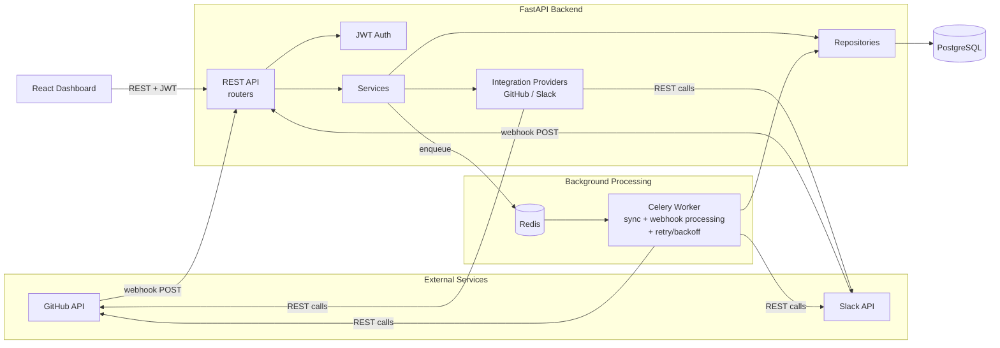

# Integration Hub

A full-stack integration platform that connects external services (GitHub and Slack), receives and processes their webhooks, synchronizes data on demand or on schedule, and gives you one dashboard to watch it all happen — with proper authentication, authorization, encrypted credential storage, retries, idempotency, and audit logging underneath.

This is a portfolio project built to demonstrate **general API integration engineering**, not a GitHub or Slack app specifically. The provider layer is abstracted so a third provider (Stripe, HubSpot, Notion, whatever a client needs next) can be added without touching routers, services, or the webhook pipeline.

> This README describes the project after a second engineering pass focused on correctness and security: cross-user data access, OAuth CSRF protection, credential encryption at rest, and refresh-token revocation were all reviewed and hardened. §22 states plainly what's fixed and what genuinely remains.

---

## 1. Problems this project demonstrates solving

- **Connecting independent systems** through OAuth 2.0 and REST APIs
- **Synchronizing data reliably** between a provider and your own database
- **Handling external API failures** gracefully — timeouts, rate limits, 5xx errors — without losing work
- **Processing webhooks correctly**, including signature verification and safe retries
- **Preventing duplicate operations** when a provider redelivers the same event (all major providers do this)
- **Managing authentication** for both end users (JWT with rotation/revocation) and third-party services (OAuth, with CSRF-protected state)
- **Enforcing authorization boundaries** so one user's data is never reachable by another, even with a guessed or leaked ID
- **Protecting credentials at rest**, not just in transit or in API responses
- **Running long-running work asynchronously** so HTTP requests and webhook deliveries stay fast
- **Monitoring integration health** — connection status, sync history, and failures, all visible in one place

---

## 2. Architecture



**Why this shape:** webhook delivery and the dashboard's REST calls both need to return fast. Anything that talks to a slow external API — a sync, or processing a webhook's side effects — is handed off to a Celery worker over Redis instead of running inline in the request/response cycle. This is the difference between a demo that "works on my machine" and one that survives GitHub disabling your webhook for responding too slowly.

### Provider abstraction

```
IntegrationProvider (abstract base, app/integrations/base.py)
    ├── GitHubProvider   (OAuth, HMAC-SHA256 webhooks, REST reads/writes)
    └── SlackProvider    (OAuth, Slack v0 signing scheme, REST reads/writes)
```

Routers, services, and the webhook pipeline only ever call `get_provider(provider_type)` from `app/integrations/registry.py`. None of them know GitHub uses `X-Hub-Signature-256` while Slack signs a composed `v0:{timestamp}:{body}` string, or that GitHub's token exchange is form-encoded while Slack's is JSON. Adding a third provider is: write one new class, register it, done.

### Sync data flow

Each provider's `run_sync()` follows the same explicit pipeline, so the abstraction holds up under more than a name and a couple of HTTP calls:

```
fetch (GET)  →  validate/normalize (Pydantic)  →  downstream action (POST)  →  record result
```

Concretely: GitHub's `GET /user/repos` response is parsed item-by-item into a `GitHubRepoSummary` Pydantic model (`app/integrations/normalized.py`); any entry that doesn't match the expected shape is skipped and logged rather than crashing the whole sync or silently propagating bad data. The normalized list then drives the downstream write (a private Gist recording the sync) and the summary returned is the *normalized* data, not a raw passthrough of whatever GitHub sent. Slack's `conversations.list` → `SlackChannelSummary` → `chat.postMessage` follows the identical shape. `tests/test_provider_sync.py` exercises this directly (mocked HTTP, real validation logic), including the "one malformed entry doesn't fail the sync" case.

---

## 3. Technology stack and why

| Layer | Choice | Why |
|---|---|---|
| API framework | FastAPI | Async-native, automatic OpenAPI docs, Pydantic validation baked in |
| ORM / migrations | SQLAlchemy 2.0 + Alembic | Explicit, typed models; migrations are reviewable, not auto-magic |
| Database | PostgreSQL | JSONB for webhook payloads, real constraints for idempotency |
| Background jobs | Celery + Redis | Mature retry/backoff primitives; decouples slow provider calls from HTTP |
| Ephemeral state | Redis | OAuth CSRF state tokens and the refresh-token allowlist (see §8, §15) — short-lived, high-churn data that doesn't belong in the system of record |
| HTTP client | httpx (async) | Non-blocking calls to GitHub/Slack from both API and worker |
| Credential encryption | `cryptography` (Fernet) | Authenticated encryption for OAuth tokens at rest (see §12) |
| Auth | JWT (python-jose) + bcrypt (passlib) | Short-lived access tokens, longer refresh tokens, industry-standard hashing |
| Frontend | React + TypeScript + Tailwind | Type-safe UI, fast iteration, no heavyweight framework needed for this scope |
| Containerization | Docker Compose | One command to run Postgres, Redis, API, worker, and frontend together |

Nothing here is enterprise-scale on purpose — no Kubernetes, no message bus, no microservices. See "Known limitations" for what a larger deployment would add.

---

## 4. External APIs selected and why

**GitHub** and **Slack** were chosen deliberately over more common demo choices (Stripe, Shopify) because together they demonstrate *different* integration patterns rather than repeating the same one twice:

| | GitHub | Slack |
|---|---|---|
| OAuth token response | form-encoded | JSON |
| Webhook signature scheme | HMAC-SHA256 over raw body | HMAC-SHA256 over `v0:{timestamp}:{body}` |
| Idempotency key | `X-GitHub-Delivery` header | `event_id` in JSON body |
| Read demo | `GET /user/repos` | `conversations.list` |
| Write demo | `POST /gists` (private sync log — doesn't touch real repos) | `chat.postMessage` |
| Free to test with | Personal access token, no app review needed | Bot token from a free Slack workspace |

Both have free developer accounts, mature documentation, and don't require a paid plan to exercise the flows this project demonstrates.

---

## 5. Project structure

```
integration-hub/
├── backend/
│   ├── app/
│   │   ├── core/            # config, security (JWT/bcrypt), crypto (credential encryption), redis client, logging, rate limiting, celery app
│   │   ├── db/               # SQLAlchemy engine/session, declarative base
│   │   ├── models/            # ORM models + shared enums
│   │   ├── schemas/           # Pydantic request/response models
│   │   ├── repositories/      # DB access, one per aggregate (users, integrations, webhooks, sync jobs, audit) — user-scoped query methods live here
│   │   ├── services/          # business logic (auth, refresh tokens, OAuth state, integration management, webhook receipt, sync execution)
│   │   ├── integrations/      # IntegrationProvider abstraction + GitHub/Slack implementations + normalized data shapes + registry
│   │   ├── routers/           # FastAPI route handlers (thin — delegate to services)
│   │   ├── workers/           # Celery task definitions (retry/backoff policy)
│   │   ├── dependencies.py    # get_current_user (JWT) FastAPI dependency
│   │   └── main.py            # app factory, middleware, exception handlers, router mounting
│   ├── alembic/                # migrations
│   ├── tests/                  # pytest suite (auth, authorization, oauth, security, webhooks, integrations, provider sync)
│   ├── requirements.txt
│   ├── Dockerfile
│   └── entrypoint.sh           # waits for DB, checks required secrets, runs migrations, then starts the app
├── frontend/
│   ├── src/
│   │   ├── api/                # typed fetch client (handles token refresh/rotation) + resource helpers
│   │   ├── context/            # AuthContext (login/register/logout, including refresh-token revocation on logout)
│   │   ├── components/         # NavBar, StatusBadge, ProviderTag, ConnectIntegrationForm
│   │   ├── pages/               # Login, Register, Dashboard, IntegrationDetail, Webhooks(+Detail), SyncJobs, Activity
│   │   └── types/                # shared TS types mirroring backend schemas
│   └── Dockerfile
├── docker-compose.yml
├── .env.example
├── .gitignore
└── README.md   ← you are here
```

---

## 6. Database schema

- **users** — email/password auth
- **integrations** — one row per (user, provider) connection; holds **encrypted** OAuth tokens (see §14), status, last sync time, last error. Unique on `(user_id, provider)`.
- **webhook_events** — every inbound webhook, unique on `(provider, external_event_id)` — this is the idempotency guarantee at the database level, not just an application-level check.
- **sync_jobs** — one row per sync attempt, tracks status/attempt_count/result_summary/error_message
- **audit_logs** — append-only activity feed (connected, disconnected, sync started/completed, webhook received/processed)

Foreign keys cascade sensibly: deleting a user deletes their integrations; deleting an integration deletes its sync jobs but only *unlinks* (`SET NULL`) its webhook events, since a webhook event is a historical record of something that happened and shouldn't disappear just because the integration was later disconnected.

OAuth CSRF state tokens and the refresh-token allowlist are **not** in this schema at all — they live in Redis with TTLs matching their natural lifetime (10 minutes and the refresh token's expiry, respectively). They're inherently short-lived, high-churn, and don't need to survive a database backup/restore, so keeping them out of Postgres avoids treating ephemeral state as if it needed the same durability guarantees as user data.

---

## 7. Authentication approach

- Passwords hashed with **bcrypt** (via passlib) — slow-by-design, salted per-hash.
- **Access tokens** (30 min default) are stateless JWTs carrying a `type: access` claim.
- **Refresh tokens** (14 days default) are JWTs carrying `type: refresh` and a unique `jti`, but signature validity alone isn't enough to accept one — see §15 for why they're also checked against a server-side allowlist.
- The `type` claim means an access token can never be presented at `/auth/refresh` and a refresh token can never be presented as a Bearer access token — both directions are tested (`tests/test_security.py`).
- The frontend's API client automatically retries a failed request once after refreshing the access token, then redirects to `/login` if the refresh token itself is invalid or has been revoked.
- Every integration/webhook/sync-job route checks ownership through the `Integration.user_id` relationship — see §9 for what changed here in this pass.

---

## 8. OAuth flow and CSRF protection

The OAuth `state` parameter is generated, persisted, and verified server-side via Redis — not just generated and forgotten:

```
GET /api/integrations/{provider}/oauth/start   (requires the user's JWT)
  → generate a random state token
  → store {user_id, provider} in Redis under that state, 10-minute TTL
  → return the provider's authorization_url (state embedded) to redirect to

... browser redirects to GitHub/Slack, user approves, provider redirects back ...

GET /api/integrations/{provider}/oauth/callback?code=...&state=...   (NO auth required)
  → GETDEL the state key from Redis (atomic read + delete in one operation)
  → missing/expired/already-used → 401, request rejected
  → provider in the stored payload must match the callback's provider → else 401
  → the user_id recovered from the state is who the connection is completed for
  → exchange code for token, store the integration, done
```

Two things worth calling out:

1. **The callback route intentionally has no `get_current_user` dependency.** It's hit by the browser being redirected from GitHub/Slack's domain — there's no guarantee an `Authorization` header survives that round trip, and requiring one would just push people toward not verifying it at all. The state token, not a JWT, is what proves which user is completing the flow.
2. **`GETDEL` makes reuse impossible, not just discouraged.** The same state value cannot complete a callback twice — the second attempt finds nothing in Redis and is rejected, whether that's an accidental double-submit or an attacker replaying a captured callback URL.

`tests/test_oauth.py` covers valid state, invalid state, expired state (simulated by deleting the key directly rather than sleeping 10 real minutes), reused state, and provider mismatch (a state issued for GitHub can't complete a Slack callback).

---

## 9. Authorization model

Every user-facing resource is reachable only through its owning user:

```
User → Integration → WebhookEvent
User → Integration → SyncJob
```

- `GET/DELETE /api/integrations/{id}`, `POST /api/integrations/{id}/sync` — scoped via `IntegrationRepository.get_for_user` (filters on `Integration.user_id`).
- `GET /api/webhooks`, `GET /api/webhooks/{id}` — scoped via `WebhookRepository.list_for_user` / `get_for_user`, which **join through `Integration.user_id`** rather than trusting the webhook event's own UUID as a secret.
- `GET /api/sync-jobs`, `GET /api/sync-jobs/{id}` — same pattern via `SyncJobRepository`.
- A request for a resource that exists but isn't yours returns **404**, not 403 — this avoids confirming the resource's existence to someone who shouldn't be able to see it either way.

This was a real gap in the first pass: `/api/webhooks` and `/api/sync-jobs` authenticated the caller but then returned data across all users. It's fixed now and covered by `tests/test_authorization.py`, which specifically proves (not just asserts) that User A cannot list or fetch-by-ID User B's integrations, webhook events, or sync jobs, and that the real owner still can.

One consequence worth noting: a webhook event whose `external_account_id` doesn't match any connected integration (`integration_id IS NULL`) isn't visible to *any* user through these endpoints — it doesn't belong to anyone yet. This is why manually-connected integrations now fetch their account identity from the provider immediately (`fetch_account_identity`, called during `POST /api/integrations` too, not just OAuth) — without a real `external_account_id` on the integration, inbound webhooks could never be linked to it in the first place.

---

## 10. Webhook architecture

```
POST /api/webhooks/{provider}
  → verify_webhook()        HMAC signature check (provider-specific); 401 if invalid or unconfigured
  → parse_webhook()          extract external_event_id, event_type, payload
  → check duplicate          SELECT by (provider, external_event_id)
  → persist event            INSERT, protected by a UNIQUE constraint as the real guarantee under races
  → enqueue Celery task       process_webhook_event.delay(event_id)
  → return 200 immediately
```

The HTTP handler never calls the provider's API or does anything slow — it verifies, dedupes, persists, and enqueues. Processing (deciding whether an event should trigger a sync, updating status, recording audit entries) happens in the Celery worker.

## 11. Idempotency strategy

Two layers, because a single check is a race condition waiting to happen:

1. **Pre-check**: `SELECT ... WHERE provider = ? AND external_event_id = ?` before inserting, so most duplicates get a fast, friendly response.
2. **Database constraint**: `UNIQUE (provider, external_event_id)` on `webhook_events`. If two identical deliveries arrive within milliseconds of each other, both can pass the pre-check — the constraint is what actually prevents a duplicate row, and the repository catches the resulting `IntegrityError` and reports it as a duplicate rather than a 500.

`tests/test_webhooks.py::test_concurrent_duplicate_delivery_only_persists_one_row` exercises layer 2 directly: two independent DB sessions both attempt to insert the identical `(provider, external_event_id)` outside of the HTTP layer's pre-check, proving the constraint — not the application logic — is what actually holds under a race.

## 12. Retry strategy

- `ProviderAPIError` carries a `retryable: bool` set at the point the error is detected (401/404/malformed → not retryable; timeouts/5xx/rate limits → retryable).
- Celery tasks retry retryable failures with **exponential backoff** (`10s × 2^attempt`, capped at 5 attempts) and mark the job/event `failed` permanently once attempts are exhausted or the error is non-retryable.
- Non-retryable 401s specifically flip the integration's status to `needs_reauthorization` rather than `failed`, since the fix is "reconnect," not "wait and retry."

## 13. Background job architecture

Celery + Redis, two task types:
- `run_integration_sync(job_id)` — loads the sync job, calls the provider's `run_sync()`, updates status/result.
- `process_webhook_event(event_id)` — marks the event processing, decides (based on event type) whether to enqueue a `run_integration_sync`, marks processed.

Each task opens and closes its own DB session — workers run in a separate process from the API, so there's no request-scoped session to reuse.

---

## 14. Security measures

- No secrets in code — everything comes from environment variables (`.env`, never committed; see `.env.example`).
- Passwords: bcrypt. JWTs: signed with `JWT_SECRET_KEY`, short-lived access tokens.
- **Integration credentials are encrypted at rest.** `access_token`/`refresh_token` are encrypted with Fernet (AES-128-CBC + HMAC-SHA256 authenticated encryption, via the `cryptography` library) before they're written to the `integrations` table, and decrypted only at the point of calling the provider's API (`IntegrationRepository.decrypt_access_token`, used in `sync_service.execute_sync_job`). The key comes from `INTEGRATION_ENCRYPTION_KEY`, never committed. The backend refuses to start without it (`entrypoint.sh` fails closed rather than silently storing plaintext). `tests/test_security.py::test_access_token_is_encrypted_at_rest` reads the raw database row directly and asserts the stored value isn't the plaintext token, then confirms it decrypts back correctly.
- **API responses never include credentials.** `IntegrationRead` (the schema every integration endpoint returns) has no `access_token`/`refresh_token` field at all — not null, not omitted-when-empty, structurally absent. Tested directly.
- **OAuth CSRF protection** via the Redis-backed state mechanism in §8.
- **Refresh token rotation and revocation** (see §15) rather than a bare stateless bearer token with no way to invalidate it.
- Webhook endpoints verify cryptographic signatures and **fail closed**: if the relevant secret isn't configured, the request is rejected rather than trusted.
- CORS is restricted to configured origins, not `*`.
- Basic per-IP rate limiting on all routes except docs/health.
- Generic error responses to clients; full details go to server-side structured logs only. Logs never include tokens, passwords, or full request bodies — only IDs, error classes, and truncated provider error text.

## 15. Refresh token security (the tradeoff, stated plainly)

Refresh tokens remain **bearer tokens returned in the JSON response body**, not HTTP-only cookies. This is a deliberate tradeoff, not an oversight:

- A cookie-based approach would need `SameSite`/`Secure` cookie configuration, a separate CSRF-token mechanism for the cookie to be safe, and changes to how the frontend's fetch client and CORS credentials work — meaningful complexity for a project at this scope, for a benefit (mitigating XSS-based token theft) that a from-scratch portfolio SPA without third-party scripts has limited exposure to in the first place.
- Instead, refresh tokens get **real, testable protection** that a bare bearer-token scheme doesn't have by default:
  - **Allowlist, not just signature validity**: each refresh token's `jti` is stored in Redis (`RefreshTokenService`) with a TTL matching its expiry. A structurally valid, unexpired JWT is still rejected if its `jti` isn't in the allowlist.
  - **Rotation on every use**: `POST /api/auth/refresh` deletes the presented token's `jti` and issues a brand-new access/refresh pair. The same refresh token can never be used twice, successfully or not — proven in `test_refresh_rotates_and_invalidates_old_refresh_token`.
  - **Explicit revocation**: `POST /api/auth/logout` deletes a token's `jti` immediately, rather than waiting out its natural expiry.
- **Accepted limitation**: rotation detects reuse (a stolen-and-replayed token fails the legitimate user's next refresh) but doesn't yet revoke the entire token *family* on detected reuse — a sufficiently patient attacker who refreshes faster than the legitimate client could theoretically stay ahead by always using the newest token. Full reuse-detection-with-family-revocation is a natural extension (see §23) but was judged unnecessary complexity for this project's threat model.
- Access tokens themselves are **not** revocable before natural expiry (they're stateless by design, that's what makes them fast to verify) — logout only affects the ability to mint *new* ones. This is called out explicitly rather than left implicit.

---

## 16. Testing

`backend/tests/` (52 tests, run against a real PostgreSQL test database) covers:

**Auth & security**
- Registration, duplicate-email rejection, login, wrong-password rejection
- Access-token vs refresh-token type enforcement (each direction tested separately)
- Refresh token rotation (old token invalidated the moment a new one is issued) and logout revocation
- Protected-route auth requirement, garbage/malformed JWT rejection
- Integration credentials never appear in any API response, and are verifiably encrypted (not just absent from the schema) in the actual database row

**OAuth**
- Valid state completes the flow and lands on the correct user's account
- Invalid, expired, and reused state are all rejected with 401
- A state issued for one provider cannot complete another provider's callback
- `/oauth/start` requires auth; `/oauth/callback` correctly does not

**Authorization**
- Cross-user integration access (get/disconnect/sync/list) — verified as both a 404 for the wrong user and a success for the right one
- Cross-user webhook event access (list + get-by-ID)
- Cross-user sync job access (list + get-by-ID)

**Webhooks & idempotency**
- Valid/invalid GitHub HMAC signatures
- Valid Slack signature, and rejection of a stale timestamp (replay protection)
- Duplicate delivery deduplication through the actual HTTP endpoint
- **Concurrent** duplicate delivery at the database-session level, proving the UNIQUE constraint (not just the application pre-check) is what holds under a race

**Integrations & provider sync logic**
- Manual token connection (including identity verification against the provider), idempotent re-connect, disconnect
- Sync trigger on a connected integration, rejection on a disconnected one
- Provider-level `run_sync` validation/normalization: malformed entries in a provider's response are skipped without failing the whole sync (both GitHub and Slack, via `respx`-mocked HTTP)
- Non-retryable errors (401) surfacing correctly as `retryable=False`

Run them with:
```bash
cd backend
pytest -v
```

External calls to GitHub/Slack are exercised two ways depending on what's being tested: `tests/test_provider_sync.py` mocks the HTTP layer directly with `respx` to test the actual validation/normalization/error-handling logic inside each provider, while `tests/test_oauth.py` and the connection tests mock at the provider-method level (`fetch_account_identity`, `exchange_code_for_token`) since those tests are about the surrounding flow (state validation, ownership, persistence), not the HTTP calls themselves.

---

## 17. Local setup

### Option A — Docker Compose (recommended)

```bash
cp .env.example .env
# edit .env: set JWT_SECRET_KEY and INTEGRATION_ENCRYPTION_KEY (see commands below)
docker-compose up --build
```

Generate the two required secrets before starting:
```bash
python -c "import secrets; print(secrets.token_hex(32))"   # JWT_SECRET_KEY
python -c "from cryptography.fernet import Fernet; print(Fernet.generate_key().decode())"   # INTEGRATION_ENCRYPTION_KEY
```

- API: http://localhost:8000 (docs at `/docs`)
- Frontend: http://localhost:5173
- Migrations run automatically on backend startup (see `backend/entrypoint.sh`), which now also refuses to start if `INTEGRATION_ENCRYPTION_KEY` is missing.

### Option B — Running services individually

```bash
# Postgres + Redis (or point DATABASE_URL/REDIS_URL at existing instances)
docker run -d -p 5432:5432 -e POSTGRES_PASSWORD=integration_hub -e POSTGRES_USER=integration_hub -e POSTGRES_DB=integration_hub postgres:16-alpine
docker run -d -p 6379:6379 redis:7-alpine

# Backend
cd backend
python -m venv venv && source venv/bin/activate
pip install -r requirements.txt
cp ../.env.example .env   # adjust DATABASE_URL/REDIS_URL to localhost, set the two secrets above
alembic upgrade head
uvicorn app.main:app --reload

# Worker (separate terminal)
celery -A app.core.celery_app worker --loglevel=info

# Frontend (separate terminal)
cd frontend
npm install
cp .env.example .env
npm run dev
```

### Database migrations

```bash
cd backend
alembic upgrade head        # apply (currently two revisions: initial schema + a NOT NULL correction)
alembic downgrade base      # roll back everything (verified to work cleanly)
alembic check                # verify models match the latest migration (no drift)
alembic revision --autogenerate -m "description"   # generate a new migration after model changes
```

---

## 18. Setting up the external APIs

You do **not** need real GitHub/Slack apps to explore the project — the "Connect integration" form in the dashboard accepts a personal access token / bot token directly. On submission, the backend immediately calls the provider to verify the token and fetch account identity (failing fast with a clear error on a bad token, rather than only discovering that on the first sync).

**GitHub** (manual token path): Settings → Developer settings → Personal access tokens → generate one with `repo`, `gist`, `read:user` scopes.

**Slack** (manual token path): create an app at api.slack.com/apps, add `channels:read` and `chat:write` bot scopes, install to your workspace, copy the `xoxb-...` Bot User OAuth Token.

For the **full OAuth flow** (`GET /api/integrations/{provider}/oauth/start`), you'll need a real OAuth app registered with each provider and `GITHUB_CLIENT_ID`/`GITHUB_CLIENT_SECRET` or `SLACK_CLIENT_ID`/`SLACK_CLIENT_SECRET` set in `.env`, with the redirect URI matching what's registered. See §8 for how the state/CSRF handshake works.

## 19. Webhook setup

1. Set `GITHUB_WEBHOOK_SECRET` / `SLACK_SIGNING_SECRET` in `.env` (generate with `openssl rand -hex 20`).
2. Expose your local backend publicly (e.g. `ngrok http 8000`) since GitHub/Slack must reach it.
3. GitHub: repo → Settings → Webhooks → Add webhook → Payload URL `https://<ngrok-domain>/api/webhooks/github`, content type `application/json`, secret = the value above, events: at minimum `push`.
4. Slack: your app's Event Subscriptions → Request URL `https://<ngrok-domain>/api/webhooks/slack`, subscribe to `app_mention` or `message.channels`.
5. Trigger an event (push a commit, mention the bot) and watch it appear in the dashboard's Webhook Events page within a second or two.

## 20. Example API requests

```bash
# Register
curl -X POST http://localhost:8000/api/auth/register \
  -H "Content-Type: application/json" \
  -d '{"email":"you@example.com","password":"a-strong-password","full_name":"Your Name"}'

# Connect GitHub with a personal access token (fetches identity from GitHub immediately)
curl -X POST http://localhost:8000/api/integrations \
  -H "Authorization: Bearer <access_token>" -H "Content-Type: application/json" \
  -d '{"provider":"github","access_token":"ghp_..."}'

# Trigger a manual sync
curl -X POST http://localhost:8000/api/integrations/<integration_id>/sync \
  -H "Authorization: Bearer <access_token>"

# Rotate tokens (old refresh_token is invalidated the instant this succeeds)
curl -X POST http://localhost:8000/api/auth/refresh \
  -H "Content-Type: application/json" -d '{"refresh_token":"<refresh_token>"}'

# Logout (revokes the refresh token immediately, rather than waiting for it to expire)
curl -X POST http://localhost:8000/api/auth/logout \
  -H "Content-Type: application/json" -d '{"refresh_token":"<refresh_token>"}'
```

Full interactive documentation: http://localhost:8000/docs

## 21. Integration flow (end to end)

1. User connects GitHub via the dashboard (manual token or OAuth via the Redis-backed state flow in §8).
2. `IntegrationService.connect_with_token` / `complete_oauth` calls `fetch_account_identity`/`exchange_code_for_token`, encrypts the resulting token (`IntegrationRepository.upsert_connection`), and marks the integration `connected`.
3. User clicks "Sync now" → `IntegrationService.trigger_sync` creates a `SyncJob` (status `pending`) and enqueues `run_integration_sync`.
4. Celery worker picks it up, decrypts the stored token, calls `GitHubProvider.run_sync()` — fetch repos, validate/normalize each entry, write a sync-log gist, return the normalized summary — updates the job to `success`, and marks the integration's `last_synced_at`.
5. Independently, GitHub sends a `push` webhook → verified, deduped, persisted, enqueued → `process_webhook_event` sees `push` is sync-triggering → creates another `SyncJob` with `trigger=webhook` → same execution path as step 4.
6. Every step along the way writes an `AuditLog` entry, visible on the Activity page, and every read of that history is scoped to the requesting user (§9).

---

## 22. Known limitations

Genuinely remaining, after this pass:

- **Refresh token reuse detection doesn't revoke the whole token family.** Rotation means a replayed old token fails, but a sufficiently fast attacker racing the legitimate client could theoretically stay one step ahead. See §15.
- **Access tokens can't be revoked before natural expiry** — only refresh tokens are checked against a server-side store. This is inherent to stateless JWTs and is an accepted tradeoff, not a gap to close later.
- `/api/webhooks` and `/api/sync-jobs` still return results scoped to the calling user's integrations only via a `JOIN` at query time rather than a denormalized `user_id` column on those tables — correct and tested, but means every list/get query does a join. Fine at this scale; worth a denormalized column if this ever needs to scale past a portfolio demo.
- Both `backend` and `worker` containers run `alembic upgrade head` on startup for simplicity; running migrations from exactly one place (a dedicated `migrate` one-off service/job) is the more correct pattern for a larger deployment.
- Rate limiting is in-process (per-container), not shared across replicas — fine for one backend instance, not for horizontal scaling.
- GitHub classic OAuth app tokens don't expire, so refresh-token handling for GitHub is a no-op by design; a GitHub App (as opposed to OAuth App) would need it.
- `INTEGRATION_ENCRYPTION_KEY` has no rotation mechanism — rotating it makes every previously stored token undecryptable (users would need to reconnect). A production system would want key versioning (e.g. a key ID stored alongside each ciphertext) before this matters at scale.

**Fixed in this pass** (previously listed here, no longer applicable): OAuth CSRF state was generated but never verified; `/api/webhooks` and `/api/sync-jobs` were authenticated but not scoped to the caller; integration credentials were stored in plaintext; refresh tokens had no revocation mechanism.

## 23. Future improvements

- Full refresh-token-family revocation on detected reuse (see §15, §22).
- Encrypted-credential key rotation/versioning.
- Redis-backed distributed rate limiting (`INCR` + `EXPIRE`) for multi-replica deployments.
- Scheduled syncs via Celery Beat (the `scheduled` `SyncTrigger` enum value is already modeled but unused).
- Webhook replay tooling from the dashboard (re-enqueue a stored event's processing).
- A third provider (e.g. Notion or HubSpot) to further prove out the abstraction.

---

## 24. What to demonstrate in a 2–3 minute portfolio walkthrough

1. **Connect GitHub** on the dashboard with a personal access token → point out the identity lookup happening immediately (fails fast on a bad token) and the status badge going to "connected".
2. **Trigger a manual sync** → show the sync job going `pending → processing → success`, and open the resulting gist link in the summary to prove it's a real API call, not a mock. Mention that the repo list going into that summary was validated/normalized, not blindly passed through.
3. **Send a real webhook** (push a commit, or replay one from GitHub's webhook deliveries UI) → show it land on the Webhook Events page within seconds, click into it to show the verified signature, raw payload, and the follow-on sync job it triggered.
4. **Send the same webhook delivery twice** (GitHub's "Redeliver" button is perfect for this) → show the second one marked `duplicate` — this is the single best moment to explain the idempotency strategy out loud.
5. **Log out and try to reuse the old refresh token** (via `/docs`, or curl) → clean 401, demonstrating revocation actually works rather than just existing as a concept.
6. **Disconnect and show the failure path**: try to sync a disconnected integration, get a clean 409 instead of a crash.

## 25. Concepts to understand before discussing this project with a client

- Why HTTP handlers for webhooks must return fast, and what happens to a webhook endpoint that doesn't (providers disable it).
- The difference between at-least-once delivery and exactly-once processing, and why idempotency keys are the standard fix.
- Why retries need to distinguish transient from permanent failures — and what exponential backoff protects against (thundering herd on the provider's API).
- Why OAuth state parameters exist at all — what a CSRF attack on an OAuth callback actually looks like without one, and why "generate a random string" isn't sufficient without persisting and verifying it server-side.
- The access-token/refresh-token split, and specifically why *rotation* (not just short expiry) is what makes a stolen refresh token detectable rather than just eventually-expiring.
- Why encrypting credentials at rest is different from just not returning them in API responses — both matter, and this project does both, deliberately, rather than treating "not in the response schema" as sufficient.
- The role of a unique database constraint as the *actual* concurrency guarantee, versus an application-level check that can race — and how to test that distinction directly rather than assuming it.
