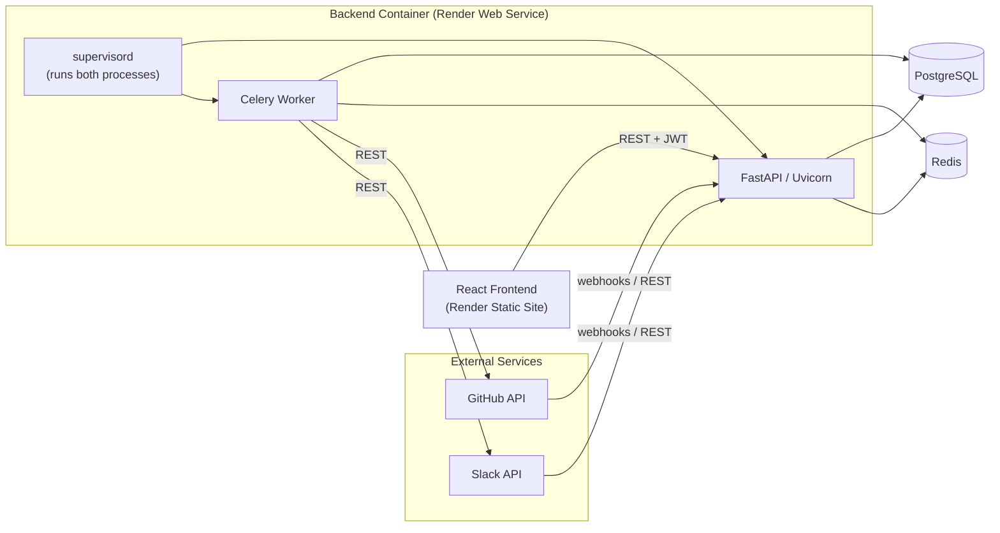

<div align="center">

# 🔗 Integration Hub

**A full-stack API integration platform — OAuth, webhooks, background sync, and audit logging, built the way a real integration between two systems has to be built.**

[](https://www.python.org/)
[](https://fastapi.tiangolo.com/)
[](https://react.dev/)
[](https://www.typescriptlang.org/)
[](https://www.postgresql.org/)
[](https://redis.io/)
[](https://www.docker.com/)

[**🚀 Live Frontend**]([https://your-frontend-url.onrender.com](https://integration-hub-frontend-g4qf.onrender.com)) &nbsp;·&nbsp; [**⚙️ Live API Docs**](https://integration-hub-api-sbdz.onrender.com) &nbsp;·&nbsp; [**📦 Source**](https://github.com/lakshay-gahlawat/integration-hub)


</div>

---

## 📖 Overview

**Integration Hub** connects external services — currently **GitHub** and **Slack** — through OAuth, listens for their webhooks, and keeps data in sync through background jobs. It's built to demonstrate the engineering that goes into *any* real API integration, not something specific to these two providers:

- Authenticating users **and** authenticating with third-party APIs
- Verifying and safely processing inbound webhooks (signatures, idempotency, retries)
- Running slow work in the background instead of blocking HTTP requests
- Keeping one user's data invisible to every other user
- Storing third-party credentials the way they actually need to be stored — encrypted, never returned in an API response

The provider layer is abstracted (`IntegrationProvider`) so a third service could be added without touching a single router or the webhook pipeline.

---

## ✨ Features

- 🔐 **JWT authentication** with rotating, revocable refresh tokens (not just short-lived access tokens)
- 🔄 **OAuth 2.0** for GitHub & Slack, with a Redis-backed, single-use CSRF state token — not just a generated-and-forgotten string
- 🪝 **Webhook pipeline**: signature verification (HMAC, provider-specific) → duplicate detection → persistence → background processing
- ♻️ **Idempotency enforced at the database level** — a unique constraint, not just an application-side check, so concurrent duplicate deliveries can't slip through
- ⏱ **Background sync jobs** via Celery, with exponential-backoff retries that distinguish transient failures (retry) from permanent ones (fail fast, flag for reconnection)
- 🔒 **Encrypted credentials at rest** (Fernet/AES) — access tokens are never stored in plaintext and never appear in any API response
- 🛡️ **Per-user authorization** on every resource — webhooks and sync jobs are scoped through the owning integration, not just gated behind "logged in"
- 📊 **Dashboard** for connected integrations, webhook history, sync job status, and a full activity/audit log
- ✅ **50+ automated tests** against a real PostgreSQL instance — including tests that simulate an actual concurrent duplicate-webhook race, not just a re-submitted request

---

## 🏗️ Architecture



**Why one container for API + worker:** running FastAPI and the Celery worker as two separate Render services is the "correct" production shape, but it also means paying for two always-on compute instances. `supervisord` runs both processes inside a single container, which keeps this deployable on Render's lower-cost tier without changing anything about how the API and worker actually communicate — they still only ever talk to each other through Redis (the Celery broker), exactly as they would if they were separate services. Splitting them back into two services later is a deployment change, not a code change.

---

## 🛠️ Tech Stack

| Layer | Technology |
|---|---|
| **Backend** | FastAPI, SQLAlchemy 2.0, Alembic, Pydantic |
| **Background jobs** | Celery + Redis |
| **Database** | PostgreSQL |
| **Auth** | JWT (access + rotating refresh tokens), bcrypt |
| **Credential security** | Fernet (AES) encryption at rest |
| **Frontend** | React, TypeScript, Tailwind CSS, Vite |
| **Testing** | Pytest, respx (mocked external API calls) |
| **Infra** | Docker, Docker Compose (local), Render (deployed) |

---

## 📁 Project Structure

```
integration-hub/
├── backend/
│   ├── app/
│   │   ├── core/           # config, JWT/security, encryption, Celery app
│   │   ├── db/              # SQLAlchemy engine/session
│   │   ├── models/           # ORM models + enums
│   │   ├── schemas/          # Pydantic request/response shapes
│   │   ├── repositories/     # all database access, one per resource
│   │   ├── services/         # business logic (auth, OAuth, webhooks, sync)
│   │   ├── integrations/     # provider abstraction + GitHub/Slack implementations
│   │   ├── routers/          # FastAPI route handlers
│   │   └── workers/          # Celery task definitions
│   ├── alembic/               # database migrations
│   ├── tests/                 # pytest suite
│   ├── Dockerfile             # runs uvicorn + Celery via supervisord
│   └── supervisord.conf
├── frontend/
│   ├── src/
│   │   ├── api/                # typed API client
│   │   ├── context/             # auth context
│   │   ├── components/          # shared UI components
│   │   ├── pages/                # dashboard, integrations, webhooks, activity
│   │   └── types/                 # shared TypeScript types
│   └── Dockerfile
├── docker-compose.yml
└── .env.example
```

---

## 🚀 Getting Started Locally

### Prerequisites
- Docker & Docker Compose
- (Optional, for running outside Docker) Python 3.11+ and Node 20+

### 1. Clone and configure

```bash
git clone https://github.com/lakshay-gahlawat/integration-hub.git
cd integration-hub
cp .env.example .env
```

Generate the two required secrets and paste them into `.env`:

```bash
# JWT_SECRET_KEY
python -c "import secrets; print(secrets.token_hex(32))"

# INTEGRATION_ENCRYPTION_KEY
python -c "from cryptography.fernet import Fernet; print(Fernet.generate_key().decode())"
```

### 2. Start everything

```bash
docker-compose up --build
```

This starts Postgres, Redis, the backend, the Celery worker, and the frontend.

### 3. Run database migrations

> The container's entrypoint no longer runs migrations automatically — run this once after your first `docker-compose up`, and again after pulling any change that adds a migration:

```bash
docker-compose exec backend alembic upgrade head
```

### 4. Open it

| Service | URL |
|---|---|
| Frontend | http://localhost:5173 |
| Backend API | http://localhost:8000 |
| Interactive API docs (Swagger) | http://localhost:8000/docs |

---

## ⚙️ Environment Variables

All variables are documented with generation commands in [`.env.example`](./.env.example). The essentials:

| Variable | Purpose |
|---|---|
| `DATABASE_URL` | PostgreSQL connection string |
| `REDIS_URL` / `CELERY_BROKER_URL` / `CELERY_RESULT_BACKEND` | Redis connection (Celery + app state) |
| `JWT_SECRET_KEY` | Signs access/refresh tokens |
| `INTEGRATION_ENCRYPTION_KEY` | Encrypts stored OAuth credentials at rest |
| `CORS_ORIGINS` | Allowed frontend origin(s) |
| `GITHUB_CLIENT_ID` / `GITHUB_CLIENT_SECRET` / `GITHUB_WEBHOOK_SECRET` | GitHub OAuth app + webhook signature verification |
| `SLACK_CLIENT_ID` / `SLACK_CLIENT_SECRET` / `SLACK_SIGNING_SECRET` | Slack OAuth app + webhook signature verification |
| `VITE_API_BASE_URL` | Where the frontend sends API requests |

---

## 🧪 Testing

```bash
docker-compose exec backend pytest -v
```

The suite runs against a real PostgreSQL instance (not an in-memory substitute) and covers authentication, cross-user authorization, OAuth CSRF state handling, webhook signature verification, concurrent-duplicate idempotency, and retry classification.

---

## 🔒 Security Highlights

- Passwords hashed with bcrypt; JWTs signed with a dedicated secret
- Refresh tokens are rotated on every use and revocable — a stolen token can't be replayed indefinitely
- OAuth state is generated, stored server-side in Redis, and consumed atomically — not just generated and trusted
- Webhook signatures are verified per-provider and **fail closed** if the signing secret isn't configured
- Integration credentials are encrypted at rest and decrypted only at the moment they're used to call an external API
- Every webhook and sync job is reachable only through the user who owns the integration it belongs to

---

## ☁️ Deployment

Deployed on [Render](https://render.com):

- **Backend** — Docker web service (FastAPI + Celery worker via `supervisord`)
- **Frontend** — static site (Vite build)
- **Database** — managed PostgreSQL
- **Redis** — managed Key Value instance (Celery broker, OAuth state, refresh-token allowlist)

---

## 🧭 Known Limitations

- Refresh-token rotation detects reuse but doesn't yet revoke an entire token family on detected reuse
- Running the API and worker in one container means they scale together, not independently — fine at this scale, a real tradeoff at higher load
- Free-tier Postgres/Redis have cold-start and storage limits not present on paid plans

---

## 👤 Author

Built by [**lakshay-gahlawat**](https://github.com/lakshay-gahlawat) as a portfolio project demonstrating backend API integration engineering.
